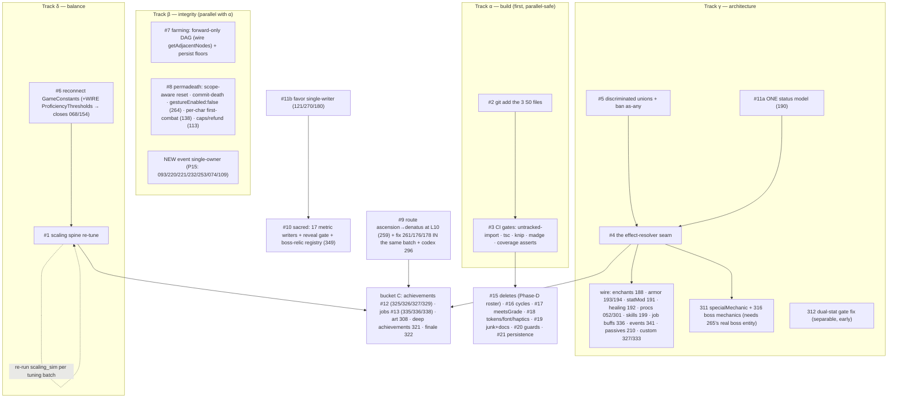

# 10 — ROOT-CAUSE LEDGER (Phase C)

> Produced 2026-06-10 (remediation S3) per Master Prompt §4. Inputs: the 371-row register (Phase A),
> `09_TRIAGE_REPORT.md` (Phase B verdicts), `08_DEFECT_PATTERNS.md` (the audit's pattern register — validated,
> corrected, and extended here). Every live finding now carries a primary pattern; rosters below are
> exhaustive over the live set (SUPERSEDED/REFUTED/MERGED/RESOLVED ancestors are absorbed by their successors).

---

## §1 — The leverage table (pattern → root fix → exhaustive closure roster → backlog mapping)

| # | Pattern | Root fix | Closes (exhaustive live IDs) | n | `06` item |
|---|---|---|---|---|---|
| **P1** | Modeled + displayed, never wired | **ONE effect-resolver seam** (data declares effect → one runtime pass applies it) **+ the 190 status-model unification it depends on** + a "no unwired effect/field" CI assert | 052 · 057 · 115 · 116 · 158 · 167 · **177** · 181 · 188 · **190 · 191 · 192** · 193 · 194 · 199 · 204(latent) · **210** · 224 · 240 · 301 · **311** · **316** · 327 · 333 · **336** · 341 · 345 | **27** | **#4** (+#11a for 190) |
| | *P1 members NOT closed by the resolver (re-pointed):* | favor sync → **#11b** (121/270 shape) · sacred metrics+reveal → **#10** (343/099/207/208) · dual-stat gate → its own surgical fix (**312**) · 299/300 → Phase-D dispositions · 292 → #18 · 034/370/045/059/198 → small per-site fixes riding #4's batches | | | |
| **P2** | Displayed-but-not-applied (the UI lies) | Rule + test: every displayed stat/effect derives from the engine-consumed value | 075 · 149/275(a) · **156/289** · 267 · 271 · 272(d) | 6 | ⚠ **GAP** — 289/156 in no `06` item (owner design call: apply the penalties per MINDSET, or stop displaying them) |
| **P3** | Duplicate / divergent data (one copy dies) | One source per concept + single-source asserts + docs regenerated from data | 060 · 064/235 · 066 · 071 · 091(doc) · 107 · 117 · 122 · 144/293 · **151→360** · 173 · 174 · 180 · 200 · 201 · 214 · 215 · 216 · 274 · 304 · 309 · 313 · 317 · 337 · 340 · 346(doc) · 348 · 350 · 365 · 366 | 30 | #6 · #15 · #19 |
| **P4** | Stringly-typed + casts defeat TS | Discriminated unions + lint-ban `as any` (ends the 352 false green **by design**) | 026 · 043 · 044 · 045 · 046 · 054 · 072 · 145 · 157 · 166 · 185(moot) · 187 · 203 · 206/344 · 209 · 218(a) · 330 · 352 | 18 | **#5** |
| **P5** | Raw `.points` read as a grade — **now 7 sites** | One `meetsGrade(stat, g)`/effStat helper + lint-ban raw `.points >=` | 218(b) · 239 · 261(a) · 279 · **318** (incl. its live consumer `boss-encounter.tsx:113-115`) · `room.tsx:583` events (B2-confirmed) · `level-up.tsx` (dead-file site) | 7 sites | **#17** |
| **P6** | Permadeath / state-integrity holes (incl. the **scope-keying** sub-family: meta-keyed where character-scoped intended — 105/138) | Scope-aware reset · forward-only DAG · global gesture/back guard · commit-death-on-defeat · per-character keying | 002 · 069 · 080 · 081 · 082 · 098 · 104 · **105** · 124 · **138** · 227 · 231(latent guard) · 234 · 246 · 248 · 254 · **264** · 277 | 18 | **#7 + #8** (⚠ 138 named by neither — fold into #8) |
| **P7** | Orphaned-by-refactor dead code | Phase-D dispositions (WIRE the pillar-backed, DELETE the proven-dead) + knip/madge/route-graph CI gate | 037 · 058 · 083/172/245 · 085/171 · 110 · 125 · 128/182(deprecated-still-wired) · 137 · 140 · 148 · **154(WIRE-candidate — the correct cost curve, dead)** · 155 · 159 · 160 · 164 · 169 · 175(+`getAdjacentNodes` = **WIRE-candidate**, the forward-only primitive 080's fix wants) · 183 · 197 · 201 · 212 · 217 · 237 · 249 · 256(styles) · **260** · 262 · 291 · 296 · 305 · 307 · 312(apparatus) · **347(WIRE)** · 354(roster) · 358(orphans) · 032/GritPanel | ~34 | **#14 + #15** |
| **P8** | Balance roots | Gate `monsterLevel` to player level · reconnect + re-curve the constants · fix the 0× triangle | **303** · 051/186/298(0×-triangle trio) · 062 · **068** · 112 · 126 · **150** · 222(physical-bias) · 364 | 10 | **#1 + #6** (⚠ 068 named by neither — close via #6-WIRE of `ProficiencyThresholds` + tune with #1) |
| **P9** | Hardcoded literals / off-token palettes | **Two lint rules** (no balance literal outside GameConstants; no hex outside Colors) + the mechanical tokenize pass | 049 · 063 · 229 · 236 · 247 · 255 · 275(b) · 280 · 284 · 297(nit) · 358(hex) · 368 | 12 | #18 + bucket-E lint (never hand-fix without the rule) |
| **P10** | Silent failure / fragile guards | Boundary fns return typed `Result` + the specific guards | 042 · 048 · 050 · 053/163(latent) · 056/226 · 076 · 087 · 092 · 097/179 · 100 · **113/282** · 114 · 119/287 · 123 · 129 · 131 · 135 · 139 · 228 · **243** · 254(b) · 265 · 268 · 329 · 333 | ~25 | ⚠ **GAP** — no dedicated `06` item; propose **#20 "guard-hardening batch"** in Phase E |
| **P11** | Uncompletable-by-construction content | Reveal-on-completion path (326) · fire the 11 dead types (325) · per-id custom checker (327) · scoped conduct counters (329/333) · the #1 floor gate | 130 · 178 · 196→325 · **326** · 329 · **332** · 322 | 7 | **#12** (+#1 gates the floors) |
| **P12 — NEW (perf)** | Unselected subscriptions, zero memoization, per-event full scans, JS-thread animations | Narrow selectors + `React.memo` leaves + index-by-metric lookups + `scaleX` bars + RAF typewriter | 101 · 132 · 230 · 238 · 256(render) · **356** · **369** · 03§2-FD | 8 | ⚠ **GAP** — only §6.4's post-G1 visual batches touch it; propose a perf batch |
| **P13 — NEW (persistence)** | `persist()` with no version/migrate/merge | One versioned-persist helper + per-store `migrate` + settings-merge | 073 · 088 · 094 · 102 · 141 · 118(adjacent: unpersisted registry) | 6 | ⚠ **GAP** — propose **#21** (S-effort; protects every future schema change) |
| **P14 — NEW (content coverage)** | Content authored to uneven depth; no coverage assertions | CI coverage asserts (per-cat weapon counts · job-per-triple · art-per-monster · bonus budget per pantheon) + authoring batches | 146 · 302(variety) · **308** · 314 · **335** · 338 · 349(66 relic-less) · 364 | 8 | #13/#14 + new asserts in #3 — *pruned from 08's P8 (the P8 root fix cannot close these)* |
| **P15 — NEW (event instrumentation)** | Behavement/progress events fired from BOTH store and screen, or from the wrong scope, or not at all | **Single-owner rule** (stores fire gameplay events; screens never) + per-floor evaluation on descent + a duplicate-fire assert | 074 · **093** · 109 · **220** · 221 · 232/253 | 7 | ⚠ **GAP** — the Paragon-bias fix (093) is in NO `06` item, yet #9's quality depends on it |

Standalone/misc (no pattern, tracked individually): 014 (peer-deps) · 084 (→#3) · 111 (scope-mislabel doc) · 323 (hygiene) · 363+OBS-12 (→#19, now **23 junk files**) · 364 (also P8).

### Headline-claim validation (the directive's numeric test)
- **"One effect-resolver closes ~30" → VALIDATED at 27**, with two conflations pruned: the favor thread (121/270) closes under **#11b** (single favor writer — different seam), and the sacred *metrics/reveal* half of 099/343 closes under **#10** (metric-writer implementations — the resolver only closes the passive layer, 210). Including the small riders (034/059/198/370) the batch family reaches ~31.
- **Hotspot prediction:** `useCombatStore` ✓ (17) · `useDungeonStore` ✓ (11) · `useSacredItemStore` ✓ (7, dense per line) · `useCharacterStore:184` ✓ (the single most load-bearing broken LINE — the always-false hybrid gate) — but **`ascension.tsx` is NOT a defect hotspot** (4): it is a *junction* — 259's missing branch points AT it; the audit's expectation is corrected.

## §2 — Findings-per-file hotspots (live findings, by canonical subject)

| File | n | Dominant patterns | Note |
|---|---|---|---|
| `app/dungeon/combat.tsx` (3,144 LOC) | **22** | P15 · P6 · P9 · P12 | the true #1 — the screen half of the soul double-count + nav cluster + dead styles |
| `useCombatStore.ts` | 17 | P1 · P8 · P9 | the resolver's future home |
| `Stats.ts` + `Character.ts` | 14 | P8 · P3 · P2 | the balance spine + the schism's persisted side |
| `Monster.ts` + `Dungeon.ts` | 14 | P7 · P3 · P8 | dead surfaces + the scaling tables |
| `useCharacterStore.ts` | 12 | P6 · P4 · P1 | incl. `:184` (312) and the ×3 duplicated routing block (071) |
| `useDungeonStore.ts` | 11 | P6 | the farming exploit's home |
| W1-T6 types (Shop/Sacred/Blacksmith/Snapshot/index) | 14 | P1 · P3 | the unwired-economy layer |
| `Weapon.ts`/`StatusEffect.ts`/`Armor.ts` | 11 | P1 · P4 | the inert-equipment layer |
| `useDeityStore.ts` | 9 | P3 · P7 | favor fragmentation |
| `app/dungeon/room.tsx` | 9+1 | P6 · P9 · P5 | +the B2-found 7th raw-points site |
| `Behavement.ts`/`Deity.ts` | 9 | P1 · P11 | the Paragon/blessing reward layer |
| `GameConstants.ts` | 5 | P3 | 16/20 dead — the "constants museum" |

## §3 — The dependency DAG

**Parallelizable now:** α ∥ β ∥ #6 ∥ #5 ∥ 312 ∥ P15. **Hard serial:** #6→#1 (tuning constants nobody reads is a no-op) · #5+#11a→#4→the wiring column · #11b→#10 · #1→all bucket C · Phase-D dispositions→the #15 DELETE batches.

## §4 — Conflict scan (fixes that change other findings' ground truth)

1. **#1 invalidates the sim baselines** → `scaling_sim.js` is the regression gate; re-run after *every* #1/#6-touching batch and re-baseline 303's numbers in `13_VERIFICATION_LOG.md`.
2. **#5 ends the 352 false green by design** → the casts' hiding spots (190-sites, 166-consumers, 218, 344's conversion, 072's null-fallback) will surface compiler errors; schedule a triage slot — new errors become new ledger rows, never silenced (§6.3).
3. **#4/#11a flip LATENTs live:** 153/061 are superseded by 312's redesign — **verify the new `primaryStats` split cannot resurrect the 061 double-dip**; 240 needs its badge fallback BEFORE new status types flow into `playerEffects`; 204 stays latent unless reveal/identify items are authored; 053/163's divisor guard ships with any monster-data batch.
4. **#2 changes 001/352's ground truth** → re-run the §3.2 recipes after the commit; #3 prevents recurrence. *(The backup branch `3b8603e` already holds the files — the master commit remains the owner-visible step.)*
5. **Wiring suffix procs (052/301) × the poison data (298):** making procs real makes poison MORE prevalent while ~53% of the bestiary is immune → re-check poison viability after; pair with the 0×-triangle fix (051/186).
6. **#9 makes 261's latent denatus defects LIVE** (raw-points ranking, mount-vs-finish strand, missing `recordParagon`) → they MUST ship in the same batch as the route, plus 176's key fix and 178's threshold re-base.
7. **#12's two halves interlock:** firing the 11 dead types without 326's reveal-on-completion path still leaves the Mythic tier dead; sequence 326 first or ship together.
8. **068×150×#1 tune together** — re-enabling the cost curve while re-curving grades while gating monster level: one balance model, one sim run, or they fight.
9. **`xpValue` must be REPURPOSED, never deleted** (OBS-10) — any monster-data cleanup batch re-runs the 222 consumer check first.
10. **#19's junk cleanup must use explicit pathspecs** — 23 junk files now known (17 root + 6 app-nested, OBS-12); a `git add -A` would enshrine them.

## §5 — Backlog gaps for Phase E (validated against `06`, per §6.1)

| Gap | Members | Proposed disposition |
|---|---|---|
| G-1: flat growth (THE balance root) | 068/154 (+150 interplay) | close via **#6-WIRE** of `ProficiencyThresholds` + tune under #1 |
| G-2: first-combat protection scope | 138 (+058 delete) | fold into **#8** (one-line per-character keying) |
| G-3: silent-failure guard class | P10 roster (incl. 113/282 gold-loss) | new **#20** guard-hardening batch (S–M) |
| G-4: event-instrumentation single-owner | P15 roster (093 bias → Paragon quality) | new batch, prerequisite-adjacent to **#9** |
| G-5: displayed-cost decision | 289/156 | owner question → QUESTIONS block (apply penalties per MINDSET vs drop the display) |
| G-6: unversioned persistence | P13 roster | new **#21** (S) |
| G-7: render-perf batch | P12 roster | formalize the §6.4 visual-batch set + a perf batch (`React.memo`/selectors/scaleX) |
